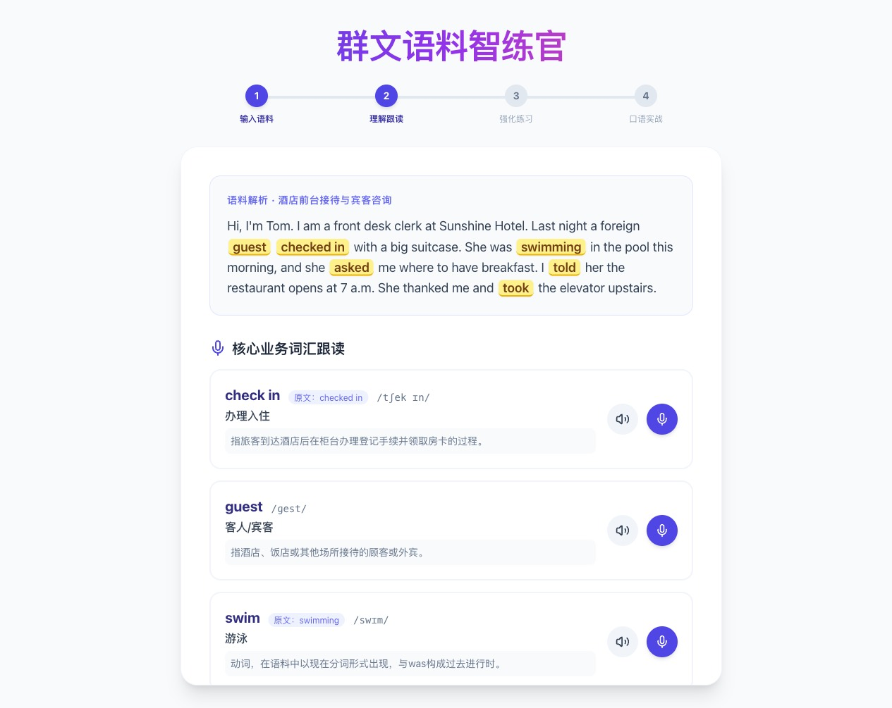
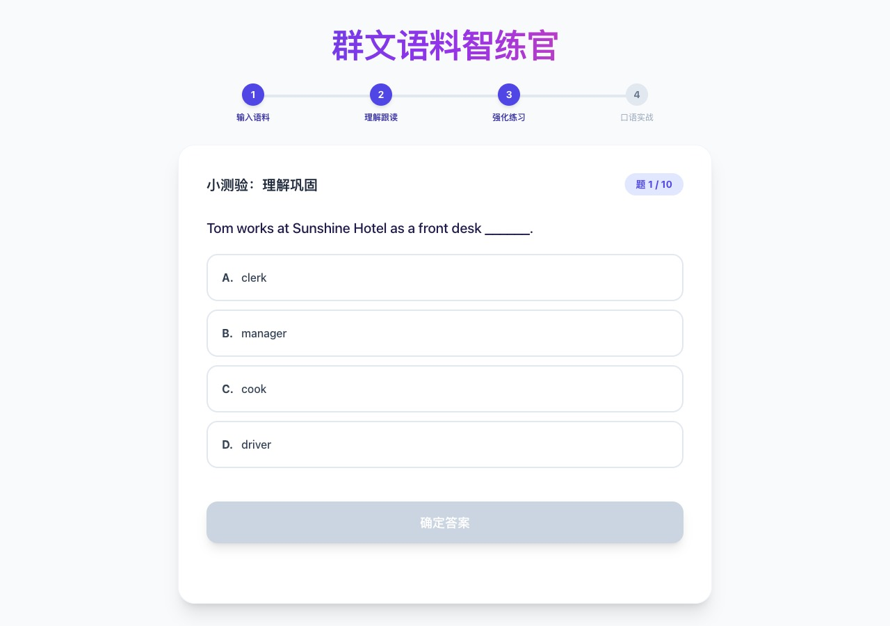

# 群文语料智练官

基于任意一段英语语料，AI 自动生成「**解析 → 跟读 → 练习 → 对话**」一整条学习闭环的 Web 应用。纯前端，托管在 GitHub Pages，用户自带 API Key。

**在线体验**：<https://vorojar.github.io/learn-en/>

## 能做什么

把任意英语段落粘进去，AI 会自动：

- **提取核心词汇**：按原形（lemma）去重，同一动词的 swim/swimming/swam 只作为一个词条
- **定位语料里所有变形**：`variants` 字段记录词在原文中的每一种实际形态，用于高亮
- **生成 10 道单选**：覆盖词汇用法、语法、语义多维度，难度由易到难
- **设计角色扮演场景**：贴合语料语境的对话任务

学习者体验：

- **跟读评测**：MediaRecorder 录音 → 发给 AI → 返回 `excellent / ok / needs_work / not_heard` 四档反馈 + 实际听到的发音
- **口语实战**：语音直接上传 AI（多模态 input_audio），AI 直接"听"你说什么后自然回复，不经中间转文字
- **状态持久化**：所有步骤数据存 localStorage，刷新不丢

## 四个步骤

### Step 1 · 输入语料


首次使用展开 "API 配置" 粘贴 key（仅保存在你浏览器的 localStorage）。随手输入一段英文语料即可。

### Step 2 · 理解跟读



原文里所有核心词汇的变形全部高亮（`checked in / swimming / asked / told / took`）；词卡主标题是**原形** (lemma)，副标签标注"原文：swimming"。

点击 🎤 录音跟读，AI 判断发音并给出具体反馈。

### Step 3 · 强化练习



10 道覆盖词汇/语法/语义的单选题，答错会给中文解析。

### Step 4 · 口语实战


AI 按语料自动设计角色扮演场景（上图：酒店前台与外宾）。点击麦克风真录音 → AI 直接听懂 → 用英语自然回复 → 浏览器 TTS 朗读。消息气泡内置波形播放器，可回放自己说过的。

## 技术栈

- **前端**：React 18 + Vite 6 + Tailwind CSS 3 + lucide-react
- **AI API**：[kie.ai](https://kie.ai) 的 `gemini-3-flash`（OpenAI 兼容 `/v1/chat/completions`，支持多模态 `input_audio`）
- **浏览器能力**：MediaRecorder（录音） + SpeechSynthesis（TTS）
- **部署**：GitHub Actions → GitHub Pages

## 为什么用户自带 Key

纯前端 SPA 无法安全存放 API key —— Vite 把 `VITE_*` 变量打进 bundle，任何人 F12 就能看到明文。

本项目选择最干净的方案：**Key 只存在用户自己的浏览器 localStorage**，永远不进仓库、不进 bundle、不上传任何服务器。换浏览器或清缓存需要重新填写。

去 [kie.ai](https://kie.ai) 注册账号拿一个 API key 即可使用。

## 本地开发

```bash
git clone https://github.com/vorojar/learn-en.git
cd learn-en
npm install
npm run dev
```

访问 `http://localhost:5173/`，展开 API 配置面板填 key 即可用。

```bash
npm run build    # 打包到 dist/
npm run preview  # 预览生产版本
```

## 部署

已通过 `.github/workflows/deploy.yml` 自动部署：任何 push 到 `main` 分支都会触发 Actions 构建并推 GitHub Pages。

## 项目结构

```
.
├── index.html             # Vite 入口
├── index.jsx              # 整个 App（单文件组件）
├── src/
│   ├── main.jsx           # React 根挂载
│   └── index.css          # Tailwind 入口
├── vite.config.js         # base: '/learn-en/' (GitHub Pages 子路径)
├── tailwind.config.js
├── .github/workflows/
│   └── deploy.yml         # Pages 部署流程
└── docs/images/           # README 截图
```

## License

MIT
